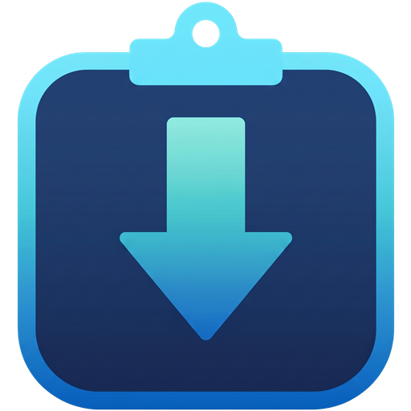

<div align="center">
  
  <h1>CopynDown</h1>
  <p>A modern, fast, and cross-platform media downloader and converter.</p>
  <p><b>Developed with 💻 by DanMixerBR</b></p>
</div>

## 🌟 Features

* **Modern GUI:** Clean and intuitive interface with native Dark Mode.
* **Cross-Platform:** Built to work seamlessly on both Windows and Linux.
* **Versatile Downloads:** Support for individual links and full playlists.
* **Built-in Converter:** Easily convert downloaded media into various formats.
* **High Quality:** Download videos up to 4K resolution and audio up to 320 kbps.

## 📸 Screenshots

<p align="center">
  
  <br>
  <em>CopynDown running on Windows.</em>
</p>

<p align="center">
  
  <br>
  <em>CopynDown running on Ubuntu.</em>
</p>

## ⚙️ Supported Sites, Formats & Resolutions

**Supported sites:** YouTube, Vimeo, Dailymotion, Twitch, Instagram, TikTok, Facebook, Twitter/X, Reddit, and SoundCloud.

**Supported video resolutions:** 2160p (4K), 1440p (QHD), 1080p (Full HD), 720p, 480p, and 360p.

**Supported audio bitrates:** 320 kbps, 256 kbps, 192 kbps, and 128 kbps.

**Supported download formats:**
* Video: MP4, MKV, and WEBM.
* Audio: M4A, MP3, FLAC, WAV, and Opus.

**Supported conversion formats:**
* Video: MP4, MKV, WEBM, MOV, and AVI.
* Audio: M4A, MP3, FLAC, WAV, Opus, and Ogg.

## 📥 Installation

### Windows
1. Download the latest release of `CopynDown_Windows.zip` from the [Releases](https://github.com/DanMixerBR/CopynDown/releases/latest/download/CopynDown_Windows.zip) page.
2. Extract the downloaded `.zip` file to your preferred folder.
3. Double-click the `CopynDown.exe` file to run the application.

### Linux
1. Download the latest release of `CopynDown_Linux.zip` from the [Releases](https://github.com/DanMixerBR/CopynDown/releases/latest/download/CopynDown_Linux.zip) page.
2. Extract the downloaded `.zip` file.
3. Right-click the `Install_CopynDown.sh` and select **"Run as a program"** (or run it via terminal).
4. Right-click `CopynDown` shortcut and select **"Allow Launching"** to run the application.

> **Note:** The Linux installation script will automatically configure the required environment and create a convenient shortcut on both your Desktop and your Application Menu!

## 🛡️ Troubleshooting

### Windows SmartScreen Warning (False Positive)
When running CopynDown for the first time on Windows, you might encounter a blue **Windows Defender SmartScreen** stating that it "protected your PC" from an unrecognized app.

**Why does this happen?**
CopynDown is an independent, open-source project. Because we haven't purchased an expensive Code Signing Certificate, Windows flags the `.exe` as an "Unknown Publisher" simply because it is new. 

**How to run CopynDown safely:**
It is completely safe to bypass this warning. To do so:
1. Click on **"More info"** at the end of the paragraph.
2. A new button will appear at the bottom. Click on **"Run anyway"**.


*Note: You will only need to do this once. If you want to verify the safety of the application, feel free to inspect the open-source code in this repository.*

## 🛠️ Build from Source

If you are a developer and want to run CopynDown directly from the Python source code:

1. Clone this repository:
   ```bash
   git clone https://github.com/DanMixerBR/CopynDown.git
   ```
2. Navigate to the project directory:
   ```bash
   cd CopynDown
   ```
3. Install the required dependencies:
   ```bash
   pip install -r requirements.txt
   ```
4. Run the application:
   ```bash
   python main.py
   ```

## 👨‍💻 Author

**DanMixerBR**  
*Creator and Lead Developer*  
If you have any questions, suggestions, or just want to say hi, feel free to reach out!
* GitHub: [@DanMixerBR](https://github.com/DanMixerBR)

## ⚖️ Credits & License

This project is built using:
* [Python](https://www.python.org/)
* [CustomTkinter](https://github.com/TomSchimansky/CustomTkinter) for the modern UI.
* [yt-dlp](https://github.com/yt-dlp/yt-dlp) for media downloading.
* [FFmpeg](https://ffmpeg.org/) for media conversion.
* [Deno](https://deno.com/) as the JavaScript runtime for executing complex extraction scripts.

This project is licensed under the MIT License - see the LICENSE file for details.
